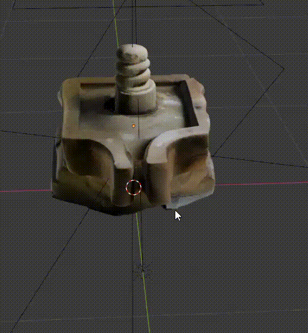
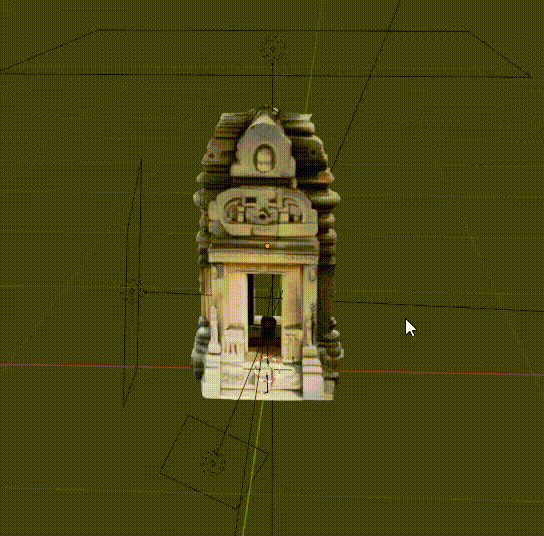

# Simhasth-X8
Documentation for creating zero-emission virtual heritage experiences using LiDAR scanning and Mixed Reality technologies. The project focuses on digitally preserving and making accessible Madhya Pradesh's remote, ecologically sensitive heritage sites through immersive digital twins with zero-emissions.

> This prototype establishes Madhya Pradesh as a pioneer in ethical, immersive spiritual tourism while building foundational infrastructure for India's metaverse economy in the heritage preservation and growing e-Tourism sector.

Zero Emission e-Tourism for Remote Heritage Sites in MP  
Team ID: TH11694  
Project Title: E Tourism for Habitat Preservation  
Company: X8 Studios (XArt Design and Motion Studio Pvt Ltd)  
Theme: Low-carbon footprint solutions/technologies  

# Repository Structure
```
heritage-digital-twins/  
├── scanning-tools/          # LiDAR and photogrammetry processing scripts  
├── unity-project/           # Unity 3D MR experience development  
├── mobile-ar-app/           # iOS/Android AR applications  
├── web-platform/            # WebXR and browser-based experiences  
├── projection-mapping/      # Dome theater projection mapping systems  
├── data-processing/         # 3D mesh optimization and cultural curation  
├── training/                # Training materials and documentation  
├── deployment-scripts/      # Cloud infrastructure and kiosk setup  
└── documentation/           # Technical guides and cultural narratives
```

# Core Technologies
- 3D Scanning: LiDAR sensors, drone photogrammetry, DSLR capture

- Processing: RealityCapture, Blender, Agisoft Metashape, BHeri Heritage Stack

- MR Development: Unity 3D, Unreal Engine, ARKit/ARCore/WebXR

- Deployment: Meta Quest, Apple Vision Pro, mobile AR, projection domes

# Core Problem Being Addressed
Madhya Pradesh hosts hundreds of ecologically and culturally sensitive heritage sites — such as Neelkantheshwar Udaypur, Bhimbetka & Udaygiri Caves, Bateshwar Morena, and many tribal forest shrines. These sites face critical challenges:

- Inaccessibility due to poor infrastructure, difficult terrain, and ecological restrictions

- Over-tourism degrading fragile ecosystems and cultural integrity

- Exclusion of elderly, differently-abled, and global diaspora unable to physically visit

- Cultural erosion due to sparse digital documentation and loss of oral traditions








# Key Features and Functionalities
1. High-Fidelity Digital Twin Creation
    - LiDAR scanning and photogrammetry pipeline for millimeter-precise 3D site capture

    - Integration with BHeri (Indigenous Bharat Heritage Stack by IIT Consortium)

    - Real-time interactive experiences transcending static 360° tours

    - GIS integration for geographic and environmental context

2. Multi-Platform Immersive Access
    - MR Headsets: Meta Quest, Apple Vision Pro for full immersion

    - Mobile AR: Cross-platform iOS/Android apps using ARKit/ARCore/WebXR

    - Dome Theater: Large-scale projection mapping for group spiritual experiences

    - XR Kiosks: Public access points at Simhastha 2028 and cultural events

3. Cultural Immersion & Storytelling
    - Multilingual voiceovers in Hindi, English, and regional dialects

    - Interactive mythic narratives rooted in local oral traditions

    - AR educational overlays covering rituals, history, archaeology, and biodiversity

    - Community-curated cultural content ensuring authenticity

4. Sustainable Tourism Ecosystem
    - Zero-emission virtual darshan eliminating carbon-intensive pilgrimage travel

    - Protection of sensitive forest and tribal heritage zones from mass tourism

    - Scalable model across 1000+ heritage locations in Madhya Pradesh

    - MSME empowerment through digital skills training and employment

5. Community Economic Development
    - Local MSME training in 3D scanning, content creation, and cultural storytelling

    - Employment opportunities in virtual guide services and tech deployment

    - Revenue streams from virtual experiences, NFT artifacts, and educational content

    - Skill development in emerging technologies for rural communities

# Technology Innovation
This represents India's first heritage-focused immersive travel solution specifically designed for ecologically sensitive and remote sacred sites. Unlike traditional virtual tours, our prototype delivers:

- Interactive, real-time MR experiences with spatial audio and haptic feedback

- Zero-emission virtual pilgrimage reducing ecological footprint

- Green-tech MSME economy in remote regions

- Alignment with National Strategy for Sustainable Tourism and Swadesh Darshan 2.0

# Target Impact & Applications
- 15 pilot heritage sites in Madhya Pradesh with deployment at Simhastha 2028

- 35M+ global Indian diaspora accessing cultural roots through virtual darshan

- Elderly and differently-abled populations experiencing barrier-free heritage tourism

- Educational institutions integrating immersive heritage into curricula

- Conservation agencies studying sensitive ecosystems non-intrusively

- Corporate CSR programs supporting sustainable tourism initiatives

# Market Alignment & Scalability
- Heritage tourism market: $32B (2024) → $57B (2033) at 6.8% CAGR

- Virtual tourism surge: 400-500% growth post-COVID

- Government investment: ₹6,500+ crore in heritage circuits and digital tourism

- Affordable technology adoption: LiDAR costs declining, MR devices under $500

- Policy support through Accessible India, Digital India, and MSME innovation schemes
